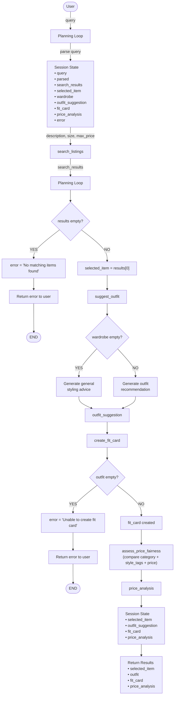

# FitFindr — Project 2

---

## Tools

### Tool 1: search_listings

**What it does:**

<!-- Describe what this tool does in 1–2 sentences -->

Searches the clothing listings dataset for items that match the user's requested description and filters them by size and maximum price. Matching results are ranked by relevance and returned to the agent.

**Input parameters:**

<!-- List each parameter, its type, and what it represents -->

- `description` (str): keywords describing the clothing item the user is searching for (e.g., "vintage graphic tee").
- `size` (str): desired clothing size
- `max_price` (float): maximum amount the user is willing to pay

**What it returns:**

<!-- Describe the return value — what fields does a result contain? -->

A list of listing dictionaries sorted by relevance. Each listing contains:

- id (str)
- title (str)
- description (str)
- category (str)
- style_tags (list[str])
- size (str)
- condition (str)
- price (float)
- colors (list[str])
- brand (str)
- platform (str)

**What happens if it fails or returns nothing:**

<!-- What should the agent do if no listings match? -->

If no matching listings are found, return an empty list. The agent informs the user that no items matched their criteria and suggests broadening the search (different keywords, size, or price range). No additional tools are called.

### Tool 2: suggest_outfit

**What it does:**

<!-- Describe what this tool does in 1–2 sentences -->

Generates outfit recommendations using the selected clothing item and the user's wardrobe. The tool identifies wardrobe pieces that match the item's style, colors, and category.

**Input parameters:**

<!-- List each parameter, its type, and what it represents -->

- `selected_item` (dict): The selected listing returned by search_listings which represents the item the user is considering buying.
- `wardrobe` (dict): A wardrobe dictionary containing an items key with a list of wardrobe item dictionaries. The list may be empty.

**What it returns:**

<!-- Describe the return value -->

A non-empty string containing:

- One or two outfit suggestions
- Specific wardrobe items when available
- Styling advice and outfit combinations
- General styling recommendations if the wardrobe is empty

**What happens if it fails or returns nothing:**

<!-- What should the agent do if the wardrobe is empty or no outfit can be suggested? -->

If wardrobe["items"] is empty, the tool should generate general styling advice for the item rather than returning an error. The agent should continue to the next step using the generated advice. The tool should always attempt to return a non-empty string.

---

### Tool 3: create_fit_card

**What it does:**

<!-- Describe what this tool does in 1–2 sentences -->

Creates a short social-media-style caption describing the outfit recommendation in a casual fashion-focused tone.

**Input parameters:**

<!-- List each parameter, its type, and what it represents -->

- `outfit` (str): Outfit recomendation suggested by suggest_outfit
- `selected_item` (dict): The listing dictionary for the thrifted item, including information such as title, price, platform, style tags, and description.

**What it returns:**

<!-- Describe the return value -->

A string containing:

- A short caption (1–3 sentences)
- Mention of the purchased item
- Description of the completed outfit
- Casual/social-media-style language

**What happens if it fails or returns nothing:**

<!-- What should the agent do if the outfit data is incomplete? -->

If the outfit string is empty or contains only whitespace, the tool returns a descriptive error message string rather than raising an exception. The agent displays the message to the user and ends the workflow.

### Additional Tools (if any)

<!-- Copy the block above for any tools beyond the required three -->

### Tool 4: assess_price_fairness

**What it does:**

<!-- Describe what this tool does in 1–2 sentences -->

Compare the price of an item against similar listings in the dataset and return a human-readable fairness assessment.

**Input parameters:**

<!-- List each parameter, its type, and what it represents -->

- `selected_item` (dict): The selected listing returned by search_listings which represents the item the user is considering buying.
- `listings` (list[dict]): A list containing all the listings in the database.

**What it returns:**

<!-- Describe the return value -->

A string containing:

- A price assessment ("cheap", "fair", or "expensive")
- The average price of comparable items
- The price range of comparable items
- Examples of similar listings used in the comparison
- A short conclusion explaining the assessment

**What happens if it fails or returns nothing:**

<!-- What should the agent do if no comparable listings are found? -->

If no comparable listings can be found, the tool returns a message indicating that there is insufficient data to assess the item's price. The agent continues execution and displays this message instead of a price assessment.

**How It Works**

After the agent finds a matching item, generates an outfit suggestion, and creates a fit card, it performs a price analysis on the selected listing. The tool compares the item's price against comparable listings from listings.json. Comparable items are defined as listings that:

- Belong to the same category (e.g., tops, bottoms, outerwear)
- Share at least one style tag with the selected item

If no listings meet both criteria, the tool falls back to comparing against items in the same category. If no suitable comparisons exist, the tool returns a message indicating that there is insufficient data to assess the price.

**Price Assessment Logic**

The tool calculates:

- The average price of comparable items
- The minimum and maximum prices in the comparison set
- The selected item's position relative to the average

The item is then classified as:

- Cheap if its price is significantly lower than comparable listings
- Fair if its price is close to the average
- Expensive if its price is significantly higher than comparable listings

---

## Planning Loop

**How does your agent decide which tool to call next?**

<!-- Describe the logic your planning loop uses. What does it look at? What conditions change its behavior? How does it know when it's done? -->

1.  Receive the user's request.
2.  Extract the item description, size preference, and maximum price.
3.  Call `search_listings(description, size, max_price).`
4.  Check the returned results

    a. If no results are returned:
    - Store an error message.
    - Return the error message to the user
    - Stop execution

    b. Otherwise:
    - Set `selected_item = results[0]`.

5.  Load the user's wardrobe.
6.  Call `suggest_outfit(selected_item, wardrobe)`.
7.  Store the returned string as `outfit`.
8.  Call `create_fit_card(outfit, selected_item)`.
9.  Store the returned string as `fit_card`.
10. Call `assess_price_fairness(selected_item, listings)`.
11. Store the returned string as `price_analysis`.
12. Return:

    a. The selected thrifted item (selected_item)

    b. The outfit suggestion

    c. The fit card caption

    d. Price analysis

13. End execution.

---

## State Management

**How does information from one tool get passed to the next?**

<!-- Describe how your agent stores and accesses state within a session. What data is tracked? How is it passed between tool calls? -->

The agent maintains a session state dictionary containing:

- "query": str,
- "parsed": dict,
- "search_results": list[dict],
- "selected_item": dict,
- "wardrobe": dict,
- "outfit_suggestion": str,
- "fit_card": str,
- "price_analysis": str,
- "error": str | None,

Information flows through the state as follows:

1. The user's query is stored in `query`.
2. The query is parsed into a clothing description, size preference, and maximum price, which are stored in `parsed`.
3. `search_listings()` uses the parsed values and stores its results in `search_results`.
4. If `search_results` is not empty, the first search result is stored in `selected_item`.
5. `selected_item` and `wardrobe` are passed to `suggest_outfit()`.
6. The returned string is stored in `outfit_suggestion`.
7. `outfit_suggestion` and `selected_item` are passed to `create_fit_card()`.
8. The returned caption is stored in `fit_card`.
9. `selected_item` is passed to assess_price_fairness() along with full listings.
10. The returned analysis is stored in `price_analysis`.
11. All results are displayed to the user.

---

## Error Handling

For each tool, describe the specific failure mode you're handling and what the agent does in response.

| Tool                  | Failure mode                          | Agent response                                                                                                                                                                                                                                                                                                                 |
| --------------------- | ------------------------------------- | ------------------------------------------------------------------------------------------------------------------------------------------------------------------------------------------------------------------------------------------------------------------------------------------------------------------------------ |
| search_listings       | No results match the query            | Inform the user that no matching items were found, suggest modifying the search criteria, and stop execution. When tested with inputs like "designer ballgown size XXS under $5", the system returned: "No matching items were found. Try broadening your search, increasing your maximum price, or using different keywords." |
| suggest_outfit        | Wardrobe is empty                     | Generate general styling advice for the selected item and continue to create_fit_card(). Example message: "Since no wardrobe items were provided, here are some general styling ideas for this item: ..."                                                                                                                      |
| create_fit_card       | Outfit input is missing or incomplete | Return a descriptive error message and stop execution. Example message: "Unable to generate a fit card because the outfit recommendation was missing or incomplete. Please try generating an outfit suggestion again."                                                                                                         |
| assess_price_fairness | No comparable items found             | Return a message indicating insufficient data for comparison but continue execution. Example message: "Not enough similar items in the dataset to evaluate pricing for this piece."                                                                                                                                            |

---

## Architecture

<!-- Draw a diagram of your agent showing how the components connect:
     User input → Planning Loop → Tools (search_listings, suggest_outfit, create_fit_card)
                                                                          ↕
                                                                   State / Session
     Show what triggers each tool, how state flows between them, and where error paths branch off.
     ASCII art, a Mermaid diagram (https://mermaid.js.org/syntax/flowchart.html), or an embedded
     sketch are all fine. You'll share this diagram with an AI tool when asking it to implement
     the planning loop and each individual tool. -->

---

## AI Usage Transparency

**Milestone 3 — Individual tool implementations:** I used ChatGPT to implement the tools in tools.py, including `search_listings`, `suggest_outfit`, `create_fit_card`, and the stretch feature `assess_price_fairness`.

I provided ChatGPT with the tool specifications from planning.md, including input parameters, expected outputs, failure modes, and the dataset structure from listings.json and wardrobe_schema.json. I also included the function docstrings and helper utilities from data_loader.py.

ChatGPT generated initial implementations for each tool. I reviewed the outputs and verified that:

- filtering logic in search_listings correctly used price, size, and keyword matching
- LLM-based tools correctly handled empty inputs and edge cases
- the wardrobe-empty fallback in suggest_outfit did not raise errors
- the price comparison tool correctly computed similarity using category and style tags

In several cases, I modified the generated code to better align with the specification, particularly around handling missing fields and ensuring empty-result cases returned safe outputs instead of errors.

**Milestone 4 — Planning loop and state management:** I used ChatGPT to help implement the planning loop in agent.py.

I provided the full Planning Loop specification, State Management rules, Error Handling table, and the architecture diagram from planning.md. I also included the tool interfaces so the model could understand how data flows between functions.

ChatGPT generated an initial version of the planning loop. I reviewed it and corrected the control flow to ensure that:

- `search_listings` is always called before any other tool
- execution stops immediately when no search results are found
- state is updated step-by-step and passed correctly between tools
- no tool is called without the required inputs being available in session state

I adjusted parts of the generated implementation where the tool ordering was too rigid or did not properly reflect conditional branching in the planning spec.

---

## Spec Reflection

One way the spec helped was by clearly separating responsibilities between tools, which made it straightforward to design the planning loop as a fixed sequence with clear state transitions between search, outfit generation, and fit card creation.

One divergence was in the implementation of suggest_outfit. Instead of treating it as a simple prompt-to-LLM call, I structured it as a dynamic prompt generator that formats wardrobe data into structured input and switches behavior depending on whether the wardrobe is empty. This added more flexibility and more realistic output, but required careful handling to ensure the function always returned a valid string in both cases.

---

## A Complete Interaction (Step by Step)

Write out what a full user interaction looks like from start to finish — tool call by tool call. Use a specific example query.

**Example user query:** "I'm looking for a vintage graphic tee under $30. I mostly wear baggy jeans and chunky sneakers. What's out there and how would I style it?"

**Step 1:**

<!-- What does the agent do first? Which tool is called? With what input? -->

The agent receives the user query and calls search_listings("vintage graphic tee", size=None, max_price=30.0) to find listings that match the user's requested item and price range.

**Step 2:**

<!-- What happens next? What was returned from step 1? What tool is called now? -->

The tool returns matching listings sorted by relevance. The agent will pick the top listing (for instance the listing with id "lst_006" and description "Vintage-style bootleg tee with faded graphic. Slightly boxy fit. 100% cotton, soft and worn-in."). With the user's wardrobe and the item the user is considering, the agent will call suggest_outfit(selected_item={band tee} , wardrobe={user's wardrobe}) to generate styling recommendations based on the user's existing wardrobe.

**Step 3:**

<!-- Continue until the full interaction is complete -->

The tool returns a string with outfit suggestions. The agent takes the suggestion and the new item and calls create_fit_card(outfit={suggestion}, selected_item={band tee}) to generate a short social-media-style caption describing the outfit.

**Step 4:**

The agent calls assess_price_fairness(selected_item, listings) to compare the selected item's price against similar items in the dataset and generate a price evaluation.

**Final output to user:**

<!-- What does the user actually see at the end? -->

The user receives:

- the selected listing
- the outfit suggestion
- the fit card caption
- the price assessment
